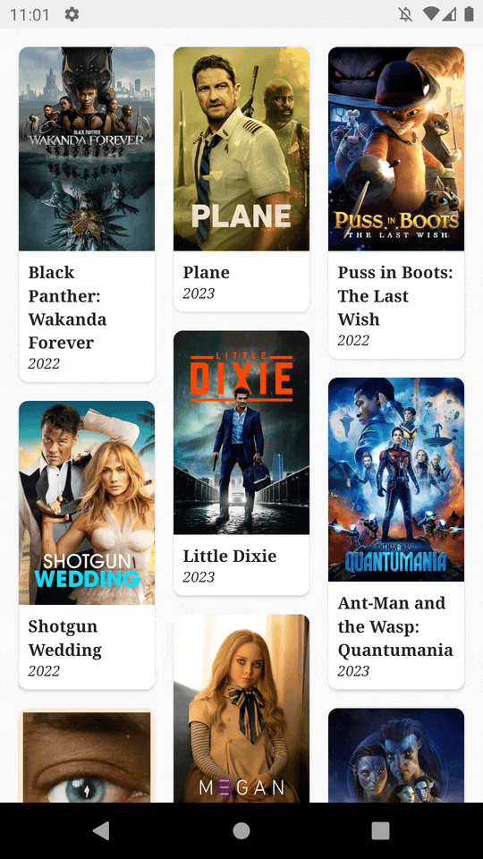
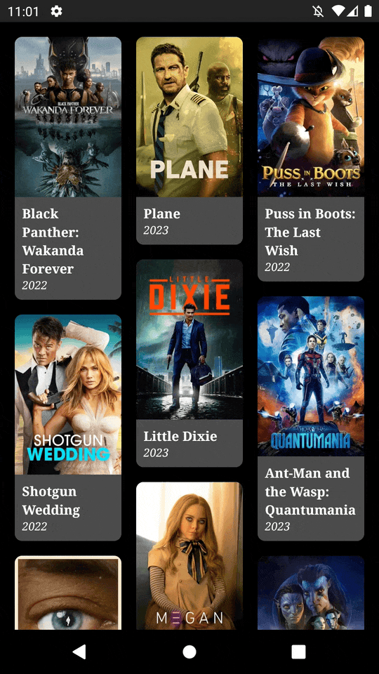
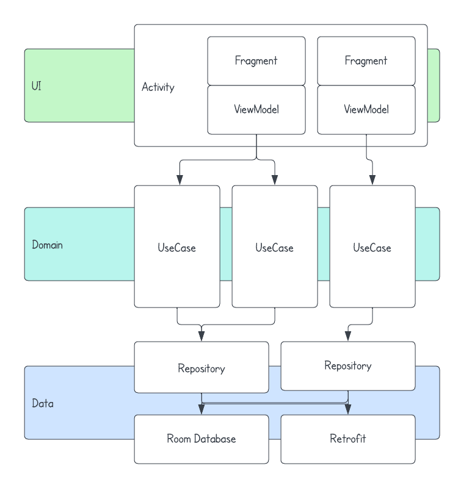

<h1 align="center">
    "The Movie Database" Android Showcase
    <br />
    <a href="https://github.com/cemtuver/android-movies/releases">
        
    </a>
</h1>

Want to try it out?
<br />
The latest APK file is available on the [releases page](https://github.com/cemtuver/android-movies/releases).

<table>
    <tr>
        <td>
            <p align="center">
                
            </p>
        </td>
        <td>
            <p align="center">
                
            </p>
        </td>
    </tr>
</table>

## Features
- List and view popular movies on [The Movie Database (TMDB)](https://www.themoviedb.org/)
- Able to run offline with local data persistence
- Dark theme

## Architecture
<table>
    <tr>
        <td>
            <b>UI layer</b>
            <ul>
                <li>Fragments with single activity</li>
                <li>ViewModel</li>
                <li>LiveData</li>
                <li>Paging3</li>
                <li>Navigation</li>
                <li>Coil</li>
            </ul>
            <b>Domain layer</b>
            <ul>
                <li>UseCase</li>
            </ul>
            <b>Data layer</b>
            <ul>
                <li>Room</li>
                <li>Room paging</li>
                <li>Retrofit</li>
                <li>RemoteMediator</li>
            </ul>
            <b>Architectural components</b>
            <ul>
                <li>Kotlin</li>
                <li>Coroutines</li>
                <li>Hilt</li>
            </ul>
            <b>Testing</b>
            <ul>
                <li>Junit4</li>
                <li>Mockk</li>
            </ul>
        </td>
        <td>
            
        </td>
    </tr>
</table>
 
## Development
### Build & Run
Before proceeding, please make sure you have an API key from the Movie Database API. You can obtain an API key by signing up for an account on their [website](https://www.themoviedb.org/documentation/api).

#### Adding your API key
The app requires an API key to access the Movie Database API. You should add your API key to the `build.gradle` file under the app folder. Open the `build.gradle` file and look for the following lines:

```
defaultConfig {
    ...
    buildConfigField("String", "MOVIE_API_KEY", "\"your_themoviedb_api_key\"")
}
```

### Testing
The repository includes a comprehensive suite of JUnit4 unit tests that cover various aspects of the app, including view models, use cases, repositories, and mappers. The purpose of these tests is to ensure that the app functions as expected and to catch any issues or bugs that may arise during development.

To run the unit tests, run the gradle command below.
```
$ ./gradlew test
```

### Linter
The repository includes a lint configuration that enforces consistent code style and identifies potential issues in the code.

To run the linter, run the gradle command below.
```
$ ./gradlew lint
```
